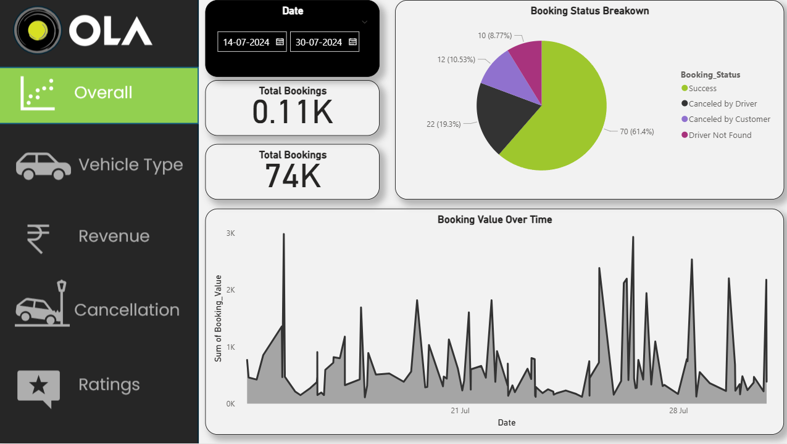
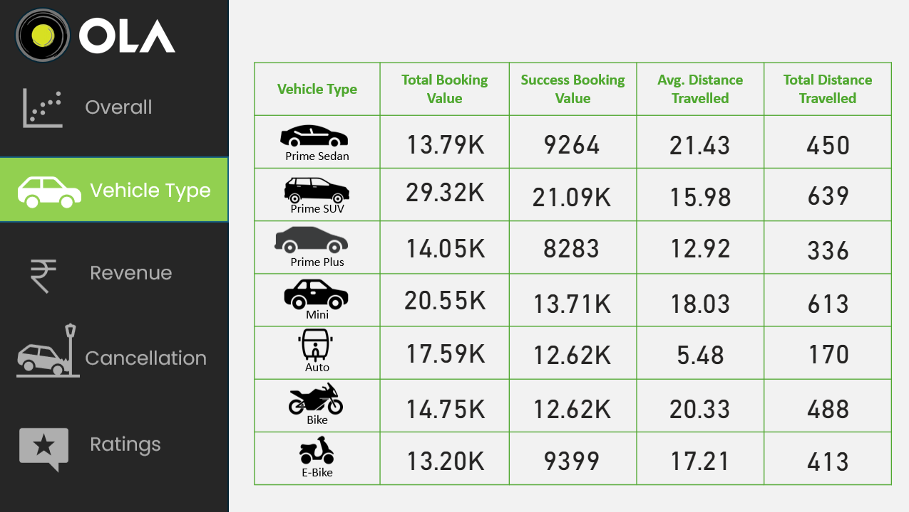
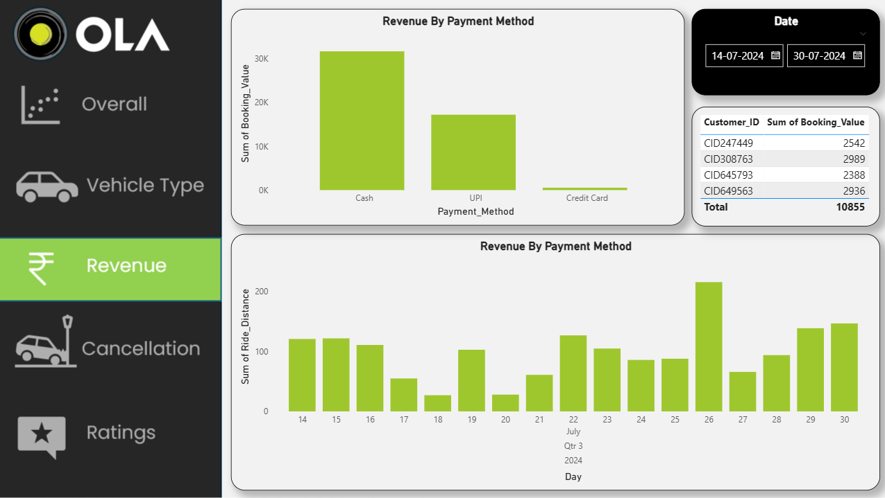
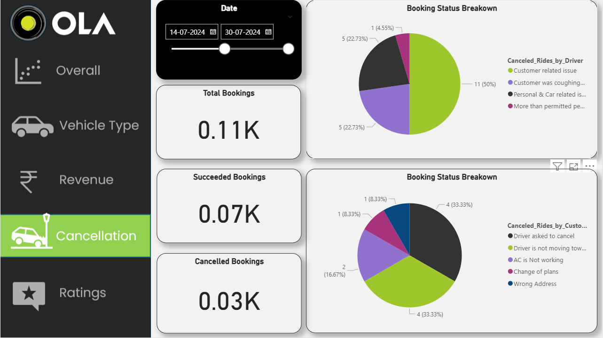
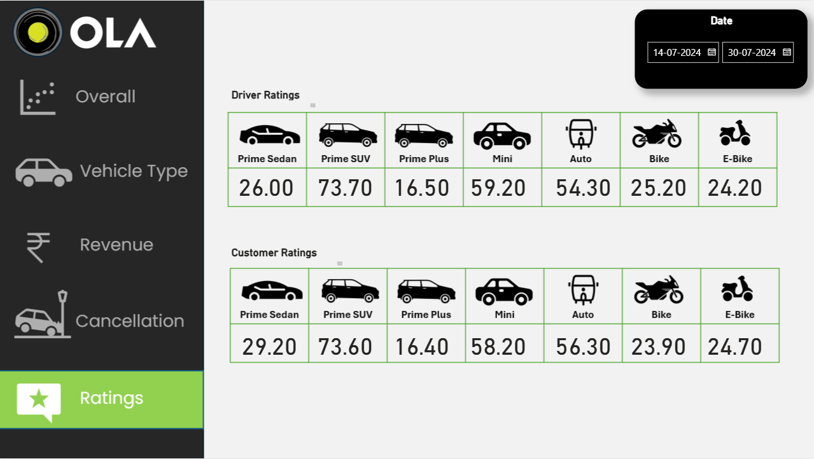

## Ola Ride Data Analysis 🚗📊

## 📌 Overview
This project analyzes Ola ride booking data to extract meaningful business insights.  
It includes a 5-page Power BI dashboard, SQL queries for data wrangling, and visuals built on cleaned data.

## 🧰 Tech Stack
- SQL
- Google Sheets
- Microsoft Power BI

## 🔍 Analysis Areas
- Booking Status Breakdown
- Booking Value Over Time
- Succeeded vs Failed Bookings
- Vehicle Type-Wise Bookings
- Revenue Analysis
- Cancellation Reasons
- Customer Rating Analysis

## 📈 Dashboard Details
The final dashboard includes:
- Line Charts, Bar Charts, Pie Charts, Cards
- Date-wise Filters & Slicers
- A total of **5 pages** covering all major KPIs and visual breakdowns

## 🖼️ Dashboard Preview

## 📁 Folder Structure
- `Dataset/` – Cleaned Ola dataset (`.csv` or `.xlsx`)
- `SQL/` – All SQL queries used in analysis
- `PowerBI_Dashboard/` – `.pbix` file of dashboard
- `Screenshots/` – Visual previews of dashboard

## 🙋‍♂️ Author
[Vicky Swain](https://www.linkedin.com/in/vicky-swain-b8a93b327/)

## 📝 License
This project is open-source and free to use.
